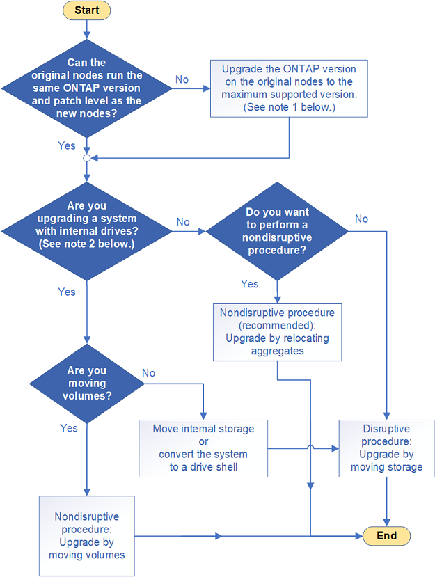

= Choose your controller hardware upgrade procedure
:icons: font
:imagesdir: ./media/

[.lead]
In general, how you upgrade the controller hardware depends on the platform models of the original nodes. You upgrade either by relocating aggregates or moving volumes (both nondisruptive procedures), or by moving the storage (a disruptive procedure). If you have different ONTAP versions running on the original and new nodes, you might need to perform a software upgrade before starting the hardware upgrade.

* Note1: The version difference between the original and new nodes cannot be greater than four. For example, ONTAP 9.8 and 9.12.1 is supported; however, ONTAP 9.8 and 9.13.1 is NOT supported.
* Note2: Models with internal drives are: FAS2520, FAS2552, FAS2554, FAS2620, FAS2650, FAS2720, FAS2750, AFF A150, AFF A200, AFF A220, AFF A250, AFF A700s, AFF A800, AFF C190, AFF C250, and AFF C800. 
+
If your system is not listed above, see the https://hwu.netapp.com[NetApp Hardware Universe^] to check if it has internal drives.

The controller hardware upgrade procedure guides you through the steps to prepare for, perform, and complete an upgrade:

* link:upgrade-arl/index.html[Upgrade by using aggregate relocation]
+
Aggregate relocation is a replacement procedure. You do not need to expand and shrink your cluster with the new nodes which is beneficial for two-node switchless clusters. Moving data by relocating aggregates is faster than copying data across aggregates when moving volumes.

* link:upgrade/upgrade-decide-to-use-this-guide.html[Upgrade by moving volumes or storage]

If you need to upgrade the ONTAP version on the original nodes, see https://docs.netapp.com/us-en/ontap/upgrade/index.html[Upgrade ONTAP^].

If you are upgrading a MetroCluster configuration, see https://docs.netapp.com/us-en/ontap-metrocluster/upgrade/concept_choosing_an_upgrade_method_mcc.html[Upgrade, refresh, or expand the MetroCluster configuration^].

If you are replacing an individual component, see the https://docs.netapp.com/us-en/ontap-systems/index.html[AFF and FAS System Documentation^] and locate the field-replaceable unit (FRU) flyer for that component.

