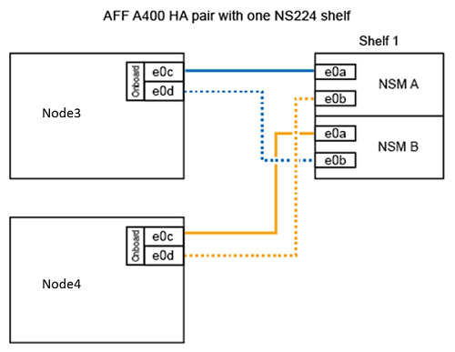

= Convert node2 to a drive shelf and connect to node4
:icons: font
:imagesdir: ../media/

[.lead]
Convert AFF A250 node2 to an NS224 drive shelf and then connect to AFF A400 node4 before reassigning drives from node2 to node4.

.Steps
. Disconnect all the network cables from node2.
. Remove node2 from the AFF A250 chassis.
. Insert the NVMe shelf module (NSM) into the bay of node2.
. Connect the NSM to node4 by cabling the node4 100GbE port e0c to NSM B port e0a.
+

. Connect the 25GbE cabling from node2 ports e0c and e0d to any two 25GbE onboard ports (e0e, e0f, e0g, or e0h) on node4.
+
NOTE: If the AFF A400 system uses FC ports as onboard ports, install a 25Gb Ethernet adapter into each node for cluster connectivity during migration:
. Connect the 25GbE HA interconnect cables between the AFF A400 nodes using ports e0a and e0b. Do not cross-connect the ports.
.. Connect the 100GbE cluster interconnect cables between the AFF A400 nodes using ports e3a and e3b. Do not cross-connect the ports.

.What's next?

link:upgrade_reassign_drives_node2_to_node4.html[Reassign drives from node2 to node4]

// 2023 Feb 1, BURT 1351102