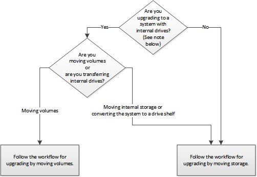

= Choose methods for upgrading controller hardware
:icons: font
:imagesdir: ../media/

[.lead]
In general, how you upgrade the controller hardware depends on the platform models of the original nodes. You upgrade either by moving the storage (a disruptive procedure) or by moving the volumes (a nondisruptive procedure).

NOTE: Models with internal drives are: FAS2520, FAS2552, FAS2554, FAS2620, FAS2650, FAS2720, FAS2750, AFF A200, AFF A220, AFF A700s, AFF A800, AFF A250.

If your system is not listed above, see the https://hwu.netapp.com[NetApp Hardware Universe^] to check if it has internal drives.

*Related information*

link:upgrade-by-moving-storage-parent.html[Workflow for upgrading by moving storage]

link:upgrade-by-moving-volumes-parent.html[Workflow for upgrading by moving volumes]

xref:aff_a250_to_aff_a400_ndu_upgrade_workflow.html.adoc[Workflow for nondisruptively upgrading an AFF A250 to AFF A400]

// 2023 Feb 1, BURT 1351102
// BURT 1493415, 2022-09-02
