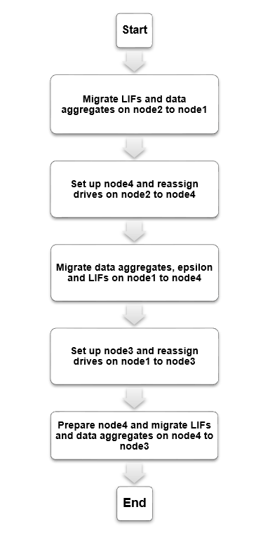

= Nondisruptive upgrade to entry level NetApp AFF and FAS systems
:icons: font
:imagesdir: ../media/

[.lead]
You can perform a nondisruptive upgrade (NDU) to entry level NetApp AFF and FAS systems without having to purchase additional storage and cluster switches. To perform the upgrade, you first prepare the original nodes and set up the new nodes. You then reassign drives to the new nodes and migrate your data. 

In this procedure, the entry high-availability (HA) pair controllers are called node1 and node2 and the new midrange or high range HA pair controllers are called node3 and node4.

.Steps
. xref:upgrade_migrate_lifs_aggregates_node2_to_node1.adoc[Migrate LIFs and data aggregates on node2 to node1]
. xref:upgrade_reassign_drives_node2_to_node4.adoc[Reassign drives from node2 to node4s]
. xref:upgrade_migrate_aggregates_epsilon_lifs_node1_node4.adoc[Migrate data aggregates, epsilon, and LIFs on node1 to node4]
. xref:upgrade_reassign_drives_node1_to_node3.adoc[Reassign drives from node1 to node3]
. xref:upgrade_migrate_lIFs_aggregates_node4_node3.adoc[Migrate LIFs and data aggregates on node4 to node3]

// 2023 Feb 1, BURT 1351102