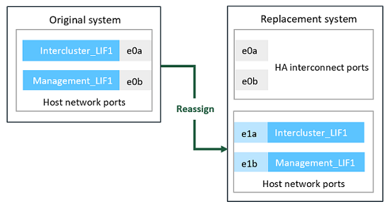

= Prepare for the upgrade when moving storage
:icons: font
:imagesdir: ../media/

[.lead]
Before upgrading by moving storage, you must gather license information from the original nodes, plan network configuration, record the system IDs, and prepare the files needed for netboot.

.Steps
. Display and record license information from the original nodes, node1 and node2:
+
`system license show`
. If you use Storage Encryption on the node1/node2 HA pair and the new nodes have encryption-enabled disks, make sure that the original nodes' disks are correctly keyed:
.. Display information about self-encrypting disks (SEDs)
+
`storage encryption disk show`
.. If any disks are associated with a non-manufacture secure ID (non-MSID) key, rekey them to an MSID key
+
`storage encryption disk modify`
. [[prepare_move_store_3]]Record port and LIF configuration information on the node1/node2 HA pair:
+
[options="header" cols="1,2"]
|===
| To display information about...| Enter...

a|
Shelves, numbers of disks in each shelf, flash storage details, memory, NVRAM, and network cards
a|
`system node run -node _node_name_ sysconfig`
a|
Cluster network and node management LIFs
a|
`network interface show -role cluster,node-mgmt`
a|
Physical ports
a|
`network port show -node _node_name_ -type physical`
a|
Failover groups
a|
`network interface failover-groups show -vserver _vserver_name_`

Record the names and ports of failover groups that are not clusterwide.
a|
VLAN configuration
a|
`network port vlan show -node _node_name_`

Record each network port and VLAN ID pairing.
a|
Interface group configuration
a|
`network port ifgrp show -node _node_name_ -instance`

Record the names of the interface groups and the ports assigned to them.
a|
Broadcast domains
a|
`network port broadcast-domain show`
a|
IPspace information
a|
`network ipspace show`
|===

. Obtain information about the default cluster ports, data ports, and node management ports for each new node that you are upgrading to: https://hwu.netapp.com[NetApp Hardware Universe^]

. [[assign_lifs]]If you are replacing an ONTAP node with a different model, you must reassign the management or intercluster LIFs configured on the network ports on the original system that are being used as high availability (HA) ports on the replacement system.
+
WARNING: Management or intercluster LIFs that are configured on affected network ports on the original system might lead to an upgrade failure by preventing the HA configuration from using the ports when booting onto the replacement system.
+
--
.. Identify the network ports on the original system that will be used as high availability (HA) ports on the replacement system. You can get this information from the https://hwu.netapp.com[NetApp Hardware Universe^]
.. Identify the management or intercluster LIFs configured on the affected network ports:
+
`network interface show -home-port _port-name_`
..  Reassign only the affected management or intercluster LIFs to network ports that are not being used as a HA ports on the replacement system:
+
`network interface modify -vserver _vserver-name_ -lif _lif-name_ -home-port <new-port-name>`
+
`network interface revert -vserver <vserver-name> -lif _lif-name_`
+
In the following example, the management and intercluster LIFs on network ports "e0a" and "e0b" are reassigned to network ports "e1a" and "e1b". Your nodes might be using different network ports because they vary by system.
+

--
// 20 June2022, GH issue #38
. [[prepare_move_store_5]]Download and prepare the files used for performing netboot.
+
After you install the new nodes, you might need to netboot to ensure the new nodes are running the same version of ONTAP as the original nodes. The term netboot means you are booting from an ONTAP image stored on a remote server. When preparing for netboot, you must put a copy of the ONTAP 9 boot image onto a web server that the system can access.

.. Access the https://mysupport.netapp.com/site/[NetApp Support Site^] to download the files used for performing the netboot of the system.
.. Download the appropriate ONTAP software from the software download section of the NetApp Support Site and store the `<ontap_version>_image.tgz` file on a web-accessible directory.
.. Change to the web-accessible directory and verify that the files you need are available.

+
[options="header" cols="1,2"]
|===
| For...| Then...

a|
*FAS2200, FAS2500, FAS3200, FAS6200, FAS/AFF8000 series systems*
a|
Extract the contents of the `<ontap_version>_image.tgz` file to the target directory:
`tar -zxvf <ontap_version>_image.tgz`

*Note:* If you are extracting the contents on Windows, use 7-Zip or WinRAR to extract the netboot image.

Your directory listing should contain a netboot folder with a kernel file:
`netboot/kernel`

a|
*All other systems*
a|
Your directory listing should contain the following file:

`<ontap_version>_image.tgz`

NOTE: You do not need to extract the contents of the `<ontap_version>_image.tgz` file.

|===

You will use information in the directory to xref:upgrade-set-up-new-nodes.adoc[set up the new nodes].

// Clean-up, 2022-03-09
